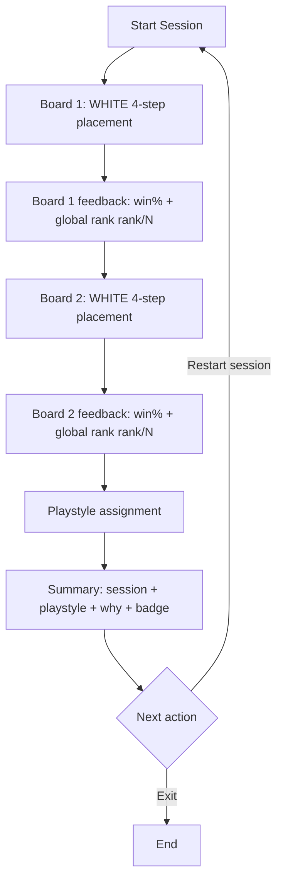

# Hex Gambit - Product Requirements (MVP)

Status: Draft  
Owner: Product  
Last Updated: 2026-02-16

## 1. Product Purpose

Hex Gambit helps players discover their opening-placement style.

After finishing a session, the product shows:

1. A `Playstyle` result
2. A short `Why this result` explanation
3. A collectible `Badge` reward

## 2. Product Vocabulary

Use these names in product copy, UI labels, and design handoff docs.

1. `Placement Set`: the fixed 2-board content package.
2. `Session`: one completed or in-progress attempt.
3. `Playstyle`: the final player style result.
4. `Why this result`: the one-line rationale for the style result.
5. `Badge`: the collectible reward shown on completion.
6. `Summary`: the final result and reward state.

## 3. Target User

Primary MVP user: `Style Explorer`.

This user wants:

1. A short, structured session
2. Clear feedback after each board
3. A simple playstyle result at the end

## 4. MVP Scope and Locked Decisions

1. The experience uses a `Placement Set` with WHITE-only opening placement (4th seat).
2. Each board follows the same 4-step flow:
- Settlement 1
- Road 1
- Settlement 2
- Road 2
3. MVP includes exactly 1 Placement Set with 2 boards.
4. A completed board cannot be replayed in the current session.
5. The player can restart the full session after entering it.
6. MVP runs locally in the browser and does not save state across web sessions.
7. The Summary must include:
- Playstyle
- Why this result
- awarded Badge

## 5. MVP Playstyles

1. `OWS Dev Card Specialist`
- Decision pattern: prioritizes Ore/Wheat/Sheep access and development-card tempo.

2. `Road Network Architect`
- Decision pattern: prioritizes road structure and expansion routes.

3. `Top-Rank Absolutist`
- Decision pattern: follows the current global #1 continuation whenever possible.

## 6. Product Goals

1. Deliver a short, deterministic session that is easy to learn.
2. Return a playstyle result that feels credible and easy to understand.
3. Keep scoring transparent with board-level rank context (`rank / N`).
4. Keep MVP local-only with no account or cloud requirements.

## 7. Non-Goals (MVP)

1. Accounts, cloud sync, or cross-session progression.
2. Multiplayer, social feed, or online leaderboards.
3. Per-board undo, rewind, or replay.
4. Full-game simulation beyond opening placement.

## 8. Core User Journey

1. Player starts a new session.
2. Player completes board 1 by selecting legal settlement and road placements on the board (WHITE 4-step flow).
3. App shows board 1 feedback: win percentage and global rank (`rank / N`).
4. Player moves to board 2 (board 1 cannot be replayed).
5. Player completes board 2 using the same board-placement interaction.
6. App shows the Summary with:
- session summary
- Playstyle
- Why this result
- Badge reward
7. Player chooses restart or exit.

## 9. Scoring and Playstyle Assignment

1. Global rank is calculated per board against all valid full WHITE sequences for that board.
2. Board feedback uses `rank / N`, where rank `1` is best.
3. Playstyle assignment uses deterministic behavior signals from both boards.
4. Every completed session returns exactly 1 Playstyle with 1 explanation.

## 10. UX Requirements

1. Show current board number and progress at all times.
2. Lock completed boards from replay within the current session.
3. Provide restart on board feedback and Summary.
4. Keep the result card scannable in seconds:
- Playstyle name
- one-line `Why this result`
- Badge visual and label
5. Keep interactions clear and deterministic on desktop and mobile.
6. Main screen copy must explicitly state that opening decisions are being evaluated and that a playstyle result will be shown at the end of the session.

## 11. Functional Requirements

1. Auto-load 1 curated Placement Set with exactly 2 boards.
2. Enforce the deterministic 4-step board state flow.
3. Enforce session progression with no single-board replay.
4. Compute board-level rank (`rank / N`) after each board.
5. Compute Playstyle using deterministic behavior rules.
6. Map each Playstyle to exactly 1 Badge.
7. Clear runtime state at the start of each new web session.

## 12. Acceptance Criteria (MVP Milestone)

1. Player can complete the full 2-board session end-to-end.
2. Player cannot replay board 1 or board 2 once completed.
3. Player can restart the full session in one action.
4. Summary always shows Playstyle, explanation, and Badge.
5. The same input path always returns the same Playstyle.
6. A new web session starts with empty state.

## 13. Risks and Mitigations

1. Risk: playstyle results feel random.
- Mitigation: deterministic rules plus concise, decision-based explanations.

2. Risk: 2 boards feel too short.
- Mitigation: treat MVP as loop validation, then expand placement-set content.

3. Risk: UX drifts toward internal tooling language.
- Mitigation: enforce Product Vocabulary in copy and review checklists.

## 14. Post-MVP Opportunities

1. More placement sets and themed content.
2. More playstyles and blended-style handling.
3. Optional cross-session badge collection.
4. Adaptive placement-set sequencing based on prior sessions.
