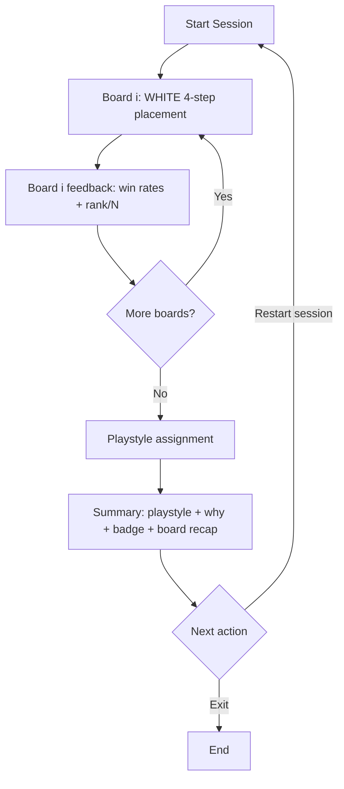

# Hex Gambit - Product Requirements (Current MVP)

Status: Active  
Owner: Product  
Last Updated: 2026-03-23

## 1. Product Purpose

Hex Gambit helps players discover their opening-placement style through a deterministic board session.

After finishing a session, the product shows:

1. A `Playstyle` result
2. A short `Why this result` explanation
3. A `Badge` reward

## 2. Product Vocabulary

Use these names in product copy, UI labels, and handoff docs.

1. `Placement Set`: curated multi-board package loaded from local fixture data.
2. `Session`: one completed or in-progress run through the full board set.
3. `Playstyle`: final style result derived from session decisions.
4. `Why this result`: one-line rationale for the winning playstyle signal.
5. `Badge`: reward label associated with the winning playstyle.
6. `Summary`: final session results screen.

## 3. Target User

Primary MVP user: `Style Explorer`.

This user wants:

1. A deterministic, structured opening-placement session.
2. Board-level feedback after each completed board.
3. A clear end-of-session style interpretation.

## 4. MVP Scope and Locked Decisions

1. WHITE-only opening placement (4th seat perspective) is evaluated.
2. Each board follows the same 4-step flow:
- Settlement 1
- Road 1
- Settlement 2
- Road 2
3. Current placement set is loaded from `apps/hex-gambit/data/boards.json` and currently contains 8 boards (`0001..0008`).
4. A completed board cannot be replayed within the active session.
5. A full-session restart is available after the session starts.
6. Runtime is local-browser only with no cross-session persistence.
7. Summary always includes playstyle, rationale, and badge.

## 5. MVP Playstyles

1. `OWS Dev Card Specialist`
- Decision pattern: prioritizes Ore/Wheat/Sheep access and development-card tempo.

2. `Road Network Architect`
- Decision pattern: prioritizes road structure and expansion lanes.

3. `Top-Rank Absolutist`
- Decision pattern: stays aligned with top-ranked continuation prefixes.

## 6. Product Goals

1. Deliver deterministic session behavior from identical inputs.
2. Keep board-level scoring transparent through `rank / N` context.
3. Keep end-of-session interpretation scannable and understandable.
4. Keep runtime local-only with no account requirement.

## 7. Non-Goals (MVP)

1. Account systems, cloud sync, or long-term progression.
2. Multiplayer, social feed, or competitive social features.
3. Per-board undo, rewind, or replay.
4. Full-game simulation beyond opening placement.

## 8. Core User Journey

1. Player starts a session from the intro screen.
2. Player completes the current board using legal settlement/road choices in WHITE 4-step flow.
3. App shows board result with win-rate context and global rank (`rank / N`).
4. Player continues to the next board until the placement set is complete.
5. App shows Summary with playstyle, rationale, badge, and board-rank recap.
6. Player may restart the full session.

## 9. Scoring and Playstyle Assignment

1. Global rank is computed per board over all valid full WHITE sequences for that board.
2. Board feedback displays rank as `rank / N` (`1` is best).
3. Session signals are aggregated across all board steps in the active placement set.
4. Signal precedence for ties is deterministic:
- `Top-Rank Absolutist`
- `OWS Dev Card Specialist`
- `Road Network Architect`
5. Every completed session returns exactly one playstyle and one rationale line.

## 10. UX Requirements

1. Show step and progress context continuously during placement flow.
2. Prevent replay of a board once its result is finalized in-session.
3. Provide restart controls from board-result and summary screens.
4. Keep summary card scannable:
- playstyle
- one-line rationale
- badge
- board-rank recap
5. Keep board interactions deterministic on desktop and mobile form factors.
6. Main intro copy must state that opening decisions are evaluated and a playstyle result is shown at completion.

## 11. Functional Requirements

1. Load one local placement set from `apps/hex-gambit/data/boards.json`.
2. Enforce deterministic legal-action progression for the 4-step board flow.
3. Enforce forward-only board progression in-session.
4. Compute board-level rank and win-rate display data after board completion.
5. Compute playstyle from deterministic signal aggregation.
6. Map each playstyle to one badge label.
7. Reset runtime state for each new browser session/restart.

## 12. Acceptance Criteria (MVP Milestone)

1. Player can complete the full board set currently configured in `boards.json`.
2. Player cannot replay a completed board during the same session.
3. Player can restart the full session in one action.
4. Summary always shows playstyle, rationale, badge, and board-rank recap.
5. Identical decision paths produce identical playstyle outputs.
6. New browser session starts with empty runtime state.

## 13. Risks and Mitigations

1. Risk: playstyle results feel arbitrary.
- Mitigation: deterministic ranking + deterministic signal precedence + explicit rationale.

2. Risk: session length may feel heavy as board count grows.
- Mitigation: keep per-board result cadence clear and summary compact.

3. Risk: product language drifts toward internal implementation terms.
- Mitigation: enforce vocabulary section during copy review.

## 14. Post-MVP Opportunities

1. Multiple placement sets with explicit difficulty/length options.
2. Additional playstyle taxonomies and mixed-style explanations.
3. Optional persistence of session history and earned badges.
