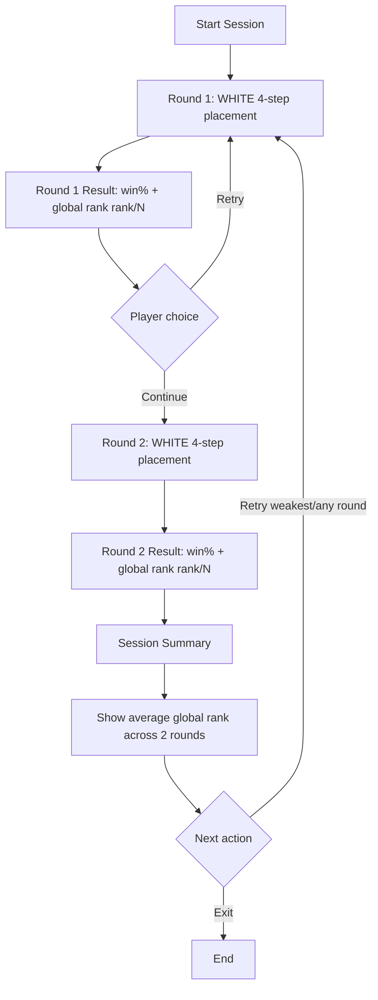

# Initial Placement Trainer - Product PRD

Status: Draft  
Owner: Product  
Last Updated: 2026-02-16

## 1. Product Intent

Build a focused opening trainer for Catan that helps competitive players practice initial placement decisions through fast, repeatable rounds with immediate, trustworthy scoring.

## 2. Problem Statement

The legacy trainer proved player interest but was not product-grade. It mixed user flow with developer tooling, exposed data-handling concerns in UI, and made practice inconsistent.

## 3. Locked MVP Decisions

1. Primary user: Competitive Player.
2. MVP mode: WHITE-only opening flow (4th player), fixed 4-step sequence:
- Settlement 1
- Road 1
- Settlement 2
- Road 2
3. MVP content size: exactly 2 rounds/levels.
4. Local-only product mode for MVP (no account, no sync, no analytics dependency).
5. Scoring anchor: Global Rank is kept.

## 4. Product Goals

1. Deliver a clean, fast training loop for opening placement quality.
2. Give immediate round feedback that competitive players can trust.
3. Preserve deterministic ranking behavior across repeated attempts.
4. Remove developer-centric interactions from normal product UX.

## 5. Non-Goals (MVP)

1. Full Catan game simulation or match play.
2. Multiplayer or social systems.
3. Account systems, cloud sync, or leaderboard launch.
4. Manual dataset upload flows in product mode.
5. Rich coaching overlays and long-form explanations.

## 6. MVP Scope

1. Two curated WHITE-only rounds with deterministic scoring.
2. Guided 4-step interaction on an interactive board.
3. Ranked option list at each step based on best continuation outcome.
4. Round completion result with:
- selected sequence win%
- global rank (`rank / N`) within that round
5. End-of-session summary after round 2 with:
- average global rank across the 2 rounds

## 7. Core Training Loop

1. User starts round 1.
2. User completes 4-step WHITE sequence.
3. App shows round result (win% + global rank).
4. User can retry or continue.
5. User completes round 2.
6. App shows session summary with average global rank for the two rounds.

## 8. Scoring Model (Product Definition)

1. Global rank is defined against all valid full WHITE sequences in the current round.
2. Display format is explicit fraction form (`rank / N`), where rank 1 is best.
3. Session summary metric is the average of the two round ranks.
4. MVP content must keep round structure comparable so average global rank remains meaningful.

## 9. UX Requirements

1. Board interaction must be clear on desktop and mobile.
2. Current step must always be explicit.
3. Illegal actions must be visibly unavailable.
4. Each valid selection immediately updates options for the next state.
5. Completion state must be scannable in under a few seconds (win% + rank first).
6. A single obvious action to proceed must always be present.

## 10. Functional Requirements

1. Product mode auto-loads curated built-in rounds.
2. Round data must validate before interaction starts.
3. Step flow must enforce deterministic 4-step state progression.
4. Ranking behavior must be deterministic and stable across retries.
5. Session summary must use only completed rounds in the current local session.
6. Product mode must not expose upload/import actions.

## 11. Acceptance Criteria (MVP Milestone)

1. Competitive player can complete both rounds end-to-end without file operations.
2. Round result always shows selected win% and global rank (`rank / N`).
3. Session end always shows average global rank over 2 rounds.
4. Replaying the same input path reproduces the same ranking outputs.
5. Product UI contains no developer-facing data plumbing actions.

## 12. Risks and Mitigations

1. Risk: Product drifts back toward developer-tool UX.
- Mitigation: enforce product-mode UX checklist in review.

2. Risk: MVP scores feel unhelpful for decision learning.
- Mitigation: keep round results minimal and clear; iterate post-MVP based on user feedback.

3. Risk: Two rounds feel too shallow for sustained use.
- Mitigation: treat MVP as loop-validation milestone before expanding round library.

## 13. Post-MVP Topics (Deferred)

1. Additional colors/seating modes.
2. Adaptive progression model inspired by chess training patterns.
3. Broader feedback model beyond rank and win%.
4. Cloud progress, identity, and social competition features.
